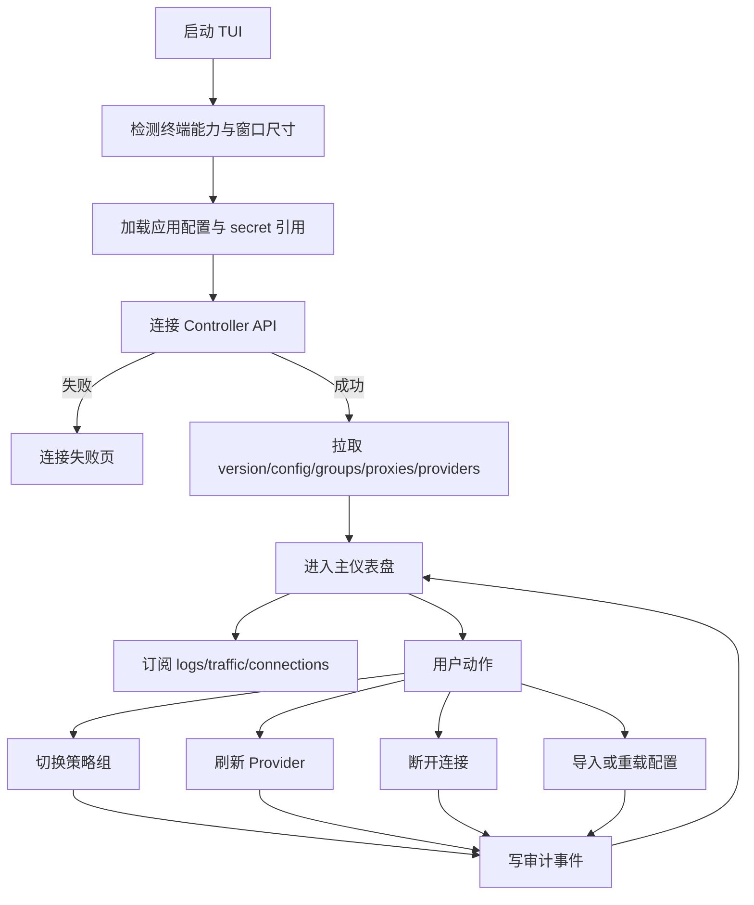
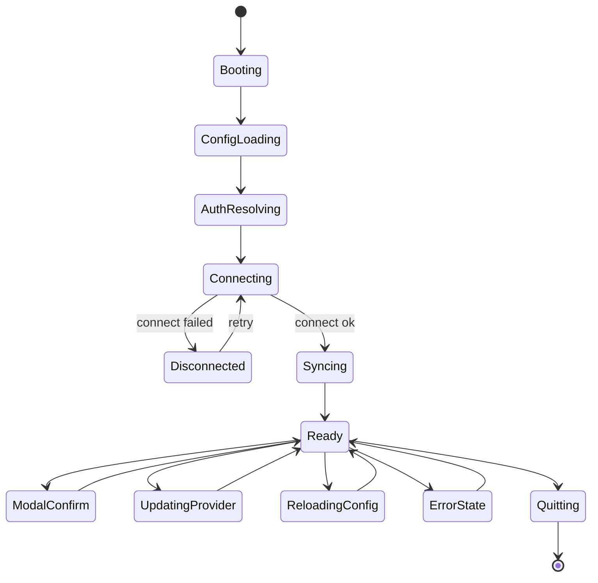
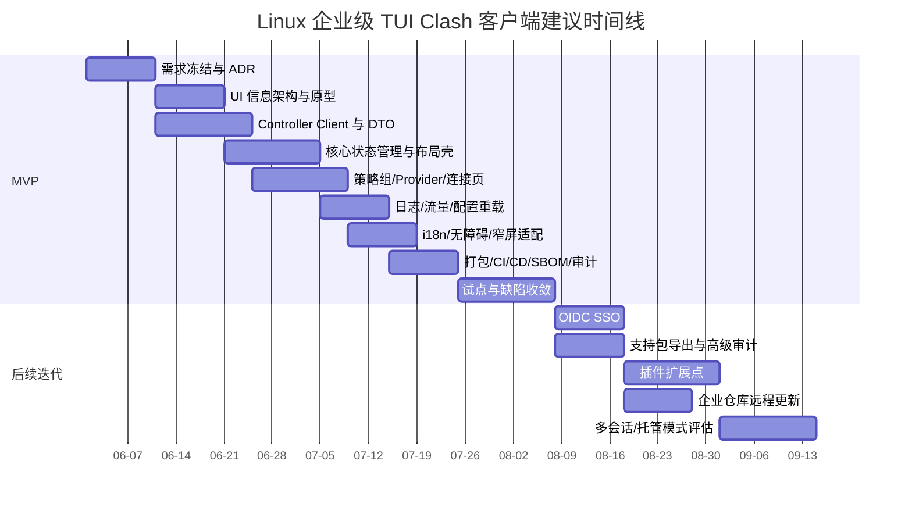

# Linux 企业级 TUI Clash 客户端方案

## 执行摘要

这套方案建议把产品定义为“**Linux 企业级 TUI 客户端，兼容 Clash External Controller 语义，默认以 Mihomo 作为内核运行时**”。原因很直接：Dreamacro Clash 原始开源版本本身就是基于规则的 Go 代理内核，提供 HTTP/HTTPS、SOCKS、GeoIP 与 Netfilter redirect 等能力；而 Mihomo 的当前官方文档把控制面、配置面、实时流接口和 Linux 相关监听器说明得更完整，公开了 `/logs`、`/traffic`、`/memory`、`/version`、`/configs`、`/group`、`/proxies`、`/providers/*`、`/connections` 等接口，适合作为 TUI 前端的稳定控制面。citeturn21search7turn39view0turn38view3

在技术栈上，**首选 Go 1.26 + Bubble Tea v2 + Lip Gloss v2 + koanf + go.yaml.in/yaml/v3**。Go 1.26 是当前最新大版本；Bubble Tea v2 官方文档明确给出了 `charm.land/bubbletea/v2` 导入路径，并强调其生产可用、基于 Elm Architecture，具备高性能 cell renderer、声明式视图、高保真键盘/鼠标处理和原生剪贴板支持；Lip Gloss v2 则负责面向终端的布局与样式；koanf 提供更轻、更模块化的分层配置；`go.yaml.in/yaml/v3` 由 YAML 官方组织维护，接手了原 go-yaml 上游的后续维护。citeturn19search0turn19search2turn40view3turn17search15turn17search19turn25view1turn25view2

在安全与合规上，最关键的决策有三条。第一，**默认不要使用 `external-controller-unix`**，因为 Mihomo 官方文档明确写明，通过 Unix Socket 或 Windows Named Pipe 访问 API 时**不会校验 secret**；企业默认应使用 `external-controller: 127.0.0.1:9090` 配合 `external-controller-tls: 127.0.0.1:9443` 与 `secret`。第二，**密钥不写入明文配置，不走环境变量直传**；Linux 优先使用 systemd credentials，其设计目标就是安全传递密码、证书和密钥，并避免环境变量继承扩散。第三，**日志以 journald 为主，OTel traces/metrics 为辅**；systemd 原生支持结构化日志写入，而 OpenTelemetry Go 当前 traces 与 metrics 稳定、logs 仍处于 Beta/experimental 状态。citeturn38view3turn32view1turn32view5turn33view1turn33view0

在交付方式上，建议把它做成**一个面向 systemd Linux 的本地控制台产品**：MVP 优先支持单用户、本机凭据、rootless UI、deb/rpm 包发布、OCI 容器发布、GitHub Actions 持续交付、GoReleaser 产物、nFPM 多格式打包、SBOM、Checksums、OSV 依赖扫描和 OpenSSF Scorecard 检查；如果后续要做企业级托管、SSO、统一审计和多租户，再把“内核服务”和“TUI 前端”拆成两个进程与两套权限边界。nFPM 官方支持 deb/rpm/apk/ipk/Arch/msix，Debian/Fedora/openSUSE/Arch 都有官方打包规范可对接。citeturn35view3turn35view4turn35view5turn33view5turn33view4turn20search0turn20search1turn20search2turn20search3

## 目标范围与决策前提

本产品的目标不是“把 Web Dashboard 原封不动搬进终端”，而是做一个**更适合企业运维、审计、键盘优先、低带宽/SSH 场景**的 Linux TUI 控制台。官方 Metacubexd Web Dashboard 已经把“实时流量、策略组管理与延迟测试、连接追踪、规则查看、实时日志、多语言”证明为高频能力集合；TUI 的目标应当是把这些主流程在 80～120 列终端中重做一遍，而且做到更快、更稳、更可审计。citeturn24search17turn39view0turn38view3

| 维度 | 当前状态 | 文档中的默认写法 | 可选方案与决策建议 |
|---|---|---|---|
| 支持的 Linux 发行版 | 未指定 | 默认以 **systemd 发行版** 为主发布目标 | 首发建议 Debian/Ubuntu + RHEL/Fedora；openSUSE/Arch 作为扩展包轨；若必须支持非 systemd 发行版，再补 supervisor/openrc 适配 |
| 目标用户规模 | 未指定 | 默认以 **单机单用户 / 小团队** 为 MVP | 若面向大组织，需增加中央策略源、RBAC、审计、远程配置与租户隔离 |
| 是否需 GUI 兼容 | 未指定 | 默认 **不承诺 GUI 同步交付** | 通过抽离 `app/service/domain` 层，为后续 GTK/Web 前端保留复用空间 |
| 是否需多用户并发 | 未指定 | 默认 **不支持一个实例的多用户并发控制** | 若后续需要，改为“核心服务 + 每用户前端会话 + 审计网关”架构 |
| 内核绑定方式 | 未指定 | 默认 **外部进程连接 Controller API** | 若公司接受 GPL 约束，可评估更深度集成；否则优先进程隔离 |
| 权限模型 | 未指定 | 默认 **UI rootless，特权能力下沉到独立 helper/service** | TUN/redirect/tproxy 等系统能力由 system service 承担，TUI 保持非 root |

| 范围 | MVP 建议包含 | MVP 建议不包含 |
|---|---|---|
| 控制面 | 连接内核、查看版本、配置校验与重载、启动/停止、选择策略组、策略延迟测试、Provider 手动更新、实时日志/流量/连接查看与断开 | 全量 Dashboard 功能镜像、复杂图表编辑器、在线订阅编辑 IDE |
| UX | 键盘优先、80 列降级布局、暗/亮主题、自定义键位、确认对话框、撤销提示、宽字符适配、中文优先 | 鼠标依赖交互、动画优先设计、彩色依赖语义 |
| 安全 | 本机 loopback + TLS + secret、systemd credentials/keyring、结构化日志、最小权限、依赖扫描、SBOM | 明文 secret 写入 YAML、root 运行 TUI、默认开放局域网控制面 |
| 企业集成 | OIDC SSO、journald、OTel traces/metrics、包仓库更新、OCI 镜像 | 首版即做中央控制平面、强制多租户、全面策略下发系统 |

面向 UX 的核心约束应当明确写入需求：**所有主流程必须可全键盘完成**，并且不能把颜色作为唯一语义；WCAG 2.2 对键盘可访问性、文本对比度和非文本对比度的要求，很适合作为终端 UI 的最低规范。建议默认主题达到文本 4.5:1，对高频主信息与错误/告警目标值按 7:1 设计；同时避免“只靠红绿”表达状态。citeturn34view2turn34view0turn34view1

## 提示词集合

下面这套提示词不是“泛用型 LLM 指令”，而是**面向工程落地**的生产提示词。每条都要求模型输出可直接进入仓库、文档或 CI 的结果。提示词默认前提：**项目是 Linux 企业级 TUI Clash 客户端，兼容 Mihomo/Clash 控制器语义，`未指定` 约束必须原样标注，不允许模型偷偷补设需求**。这类提示词最好与仓库中的 `docs/adr/`、`docs/spec/`、`pkg/`、`internal/`、`.github/` 等目录配套使用。其工程前提分别对齐了 Bubble Tea 的 TEA 模型、Mihomo 的控制器 API 与 systemd/Linux 集成能力。citeturn40view3turn39view0turn38view3

| 分类 | 示例提示词 | 预期输出格式 |
|---|---|---|
| 架构 | `你是首席架构师。请为一个 Linux 企业级 TUI Clash 客户端输出 ADR。前提：兼容 Mihomo External Controller API；MVP 单机单用户；未指定项必须写“未指定”；默认 systemd --user；严禁把 GPL 内核静态链接进闭源前端方案里。请输出：上下文、方案候选、权衡表、推荐架构、模块边界、失败模式、回滚策略、mermaid 组件图。` | `docs/adr/ADR-architecture.md`，包含 Markdown 表格、风险矩阵、Mermaid 图 |
| UI/UX 设计 | `你是 TUI UX 设计师。请为 80/120 列终端设计 Clash 控制台信息架构。要求：键盘优先、鼠标可选、中文优先、色彩不是唯一语义、对 SSH 高延迟友好。请输出：导航结构、页面层级、键位图、焦点流转、空态/错态/加载态、ASCII 原型。` | Markdown 规格文档 + ASCII 线框图 + 键位表 |
| 交互文案 | `请为下列场景写企业级 TUI 文案：首次连接失败、secret 错误、配置校验失败、Provider 更新成功、连接已断开、切换策略组确认、危险操作二次确认。要求：简短、可执行、可国际化、避免指责用户。每条输出 zh-CN / en-US / 开发者注释。` | YAML 或 JSON 文案目录，如 `i18n/zh-CN.yaml`、`i18n/en-US.yaml` |
| 实现代码片段 | `请生成可编译的 Go 代码，使用 Bubble Tea v2 和 Lip Gloss v2，实现一个三栏 TUI：左侧导航、中间策略组、右侧连接详情。要求：TEA 模式、context 取消、错误边界、宽字符安全、单元测试桩。请按文件输出。` | `tree + code blocks`，按 `cmd/`、`internal/ui/`、`internal/domain/` 分文件输出 |
| API 封装 | `请基于 Mihomo API 设计 Go 接口层，覆盖 /version /configs /group /proxies /providers/proxies /connections /logs /traffic。要求：接口定义、DTO、错误映射、WS 流封装、重试和超时策略、假实现 mock。` | Go 接口文件 + DTO + 错误码对照表 |
| 状态管理 | `请为 Bubble Tea 应用设计状态树。要求：区分持久状态、会话状态、视图状态、流式状态、错误状态；支持撤销提示与后台刷新；输出状态树、事件列表、reducer/update 伪代码。` | Markdown 状态图 + Go 伪代码 |

| 分类 | 示例提示词 | 预期输出格式 |
|---|---|---|
| 测试用例 | `请为 Linux 企业级 TUI Clash 客户端生成测试矩阵。范围：配置解析、API 客户端、Reducer、布局回归、WebSocket 流、systemd 集成、deb/rpm 安装升级、性能、压力、恢复。对每类输出：目标、前置条件、步骤、期望、失败信号、自动化层级。` | `docs/testing/test-matrix.md` + `tests/` 目录草案 |
| 自动化脚本 | `请输出 CI/CD 脚本：Go test、fuzz、OSV 扫描、Scorecard、GoReleaser、nFPM、SBOM、Checksums、容器镜像构建。要求：GitHub Actions YAML、Bash 脚本、缓存策略、失败即阻断。` | `.github/workflows/*.yml` + `scripts/*.sh` |
| 国际化 | `请把下列 TUI 文案整理为 go-i18n 可用目录。要求：处理复数、变量插值、区域回退、开发者说明，输出 zh-CN / en-US。` | `active.zh-CN.yaml` / `active.en-US.yaml` |
| 无障碍 | `请审查一个终端 UI 方案，重点检查：键盘可达、无颜色依赖、焦点可见、文本对比度、动态区域可暂停、长列表可定位。请输出问题清单、严重级别、修复建议与验收标准。` | 可访问性审查报告（Markdown 表格） |
| 性能调优 | `请分析一个 Bubble Tea TUI 的高 CPU/高重绘问题，输出：瓶颈假设、采样点、pprof 计划、重绘去抖策略、WS 限流策略、缓存方案、性能预算。` | Markdown 性能报告 + pprof/benchmark 操作步骤 |
| 安全审计 | `请对 Linux TUI Clash 客户端做安全设计审计。要求：控制面暴露、secret 处理、日志脱敏、权限边界、供应链安全、许可证风险、systemd hardening、容器 rootless。输出检查清单与自动化命令。` | 审计 Checklist + Shell 脚本 |
| 部署与运维 | `请输出企业部署手册：deb/rpm 发布、systemd --user 与 system service、SSO、日志集中、远程更新、回滚、备份恢复、离线安装、Podman/Docker rootless。要求分环境：开发、测试、生产。` | `docs/ops/runbook.md` + systemd unit + release 流程图 |

在团队实践里，建议让所有提示词都遵守统一输出契约：**“先给目录树，再给文件内容，所有假设单列为 `Assumptions`，所有 TODO 单列为 `Open Questions`”**。这样最容易让产出物被代码评审、技术评审和安全评审复用。

## 开发文档蓝图

完整开发文档应该以“**需求 → 架构 → 模块 → 数据流 → 状态 → 配置 → 扩展 → 测试 → 交付 → 运行 → 恢复 → 合规**”的顺序展开。接口章节需对齐 Mihomo 当前 API；配置章节需对齐其控制面与 Linux 选项，例如 `external-controller`、`external-controller-tls`、`secret`、`find-process-mode`、`external-ui*` 与 `SAFE_PATHS` 等，并把“Unix socket 不校验 secret”写为显式风险。citeturn39view0turn38view3

| 章节 | 必答问题 | 详细内容 | 推荐交付物 |
|---|---|---|---|
| 需求 | 解决谁的什么问题 | 用户画像、典型场景、MVP/非目标、外部依赖、未指定项列表、约束与成功标准 | `docs/spec/requirements.md` |
| 架构 | 为什么这么分层 | 进程边界、模块边界、失败隔离、权限边界、核心 API 依赖、可观测性入口 | `docs/architecture/overview.md` |
| 模块设计 | 每个模块负责什么 | `controller`、`domain`、`ui`、`state`、`config`、`secrets`、`telemetry`、`plugins` | `docs/architecture/modules.md` |
| API | 如何封装内核能力 | REST/WS 客户端、DTO、错误映射、超时、幂等、重试、流式关闭策略 | `docs/api/controller-client.md` |
| 数据流 | 数据如何流动 | 启动装载、配置导入、策略切换、连接刷新、日志流、审计日志写入、故障回退 | `docs/architecture/dataflow.md` |
| 状态管理 | 为什么 UI 不会乱 | TEA 状态树、事件总线、异步命令、流式订阅、缓存与失效、撤销/确认机制 | `docs/architecture/state.md` |
| 配置格式 | 怎么保存应用配置 | 应用配置与内核配置分离；本地偏好、Profile、secret 引用、终端主题、快捷键、日志级别 | `docs/config/app-config.md` |
| 插件与扩展点 | 将来怎么扩展 | ConfigSource、AuthProvider、NotificationSink、PolicyProvider、ThemeProvider、AuditSink | `docs/extensibility/plugins.md` |
| 测试策略 | 如何保证质量 | 单元/集成/E2E/Golden/Fuzz/安装升级/性能/压力/恢复测试；测试环境与伪造内核 | `docs/testing/strategy.md` |
| CI/CD | 如何从提交到发布 | PR 检查、签名、SBOM、Checksums、版本语义、打标签、发布审批、工件留存 | `docs/delivery/cicd.md` |
| 发布与回滚 | 出问题如何退回 | 分阶段发布、包仓库回滚、systemd 重启策略、兼容性矩阵、数据库/缓存处理 | `docs/delivery/release-rollback.md` |
| 监控与日志 | 怎么发现故障 | journald 字段、日志脱敏、关键指标、trace/metric、告警阈值、支持包导出 | `docs/ops/observability.md` |
| 备份与恢复 | 用户数据怎么保 | 配置、Profile、本地缓存、操作审计、恢复顺序、校验步骤、灾备演练脚本 | `docs/ops/backup-recovery.md` |
| 合规与安全 | 如何过审 | GPL 风险、第三方许可证清单、secret 管理、最小权限、供应链安全、SSO、审计留痕 | `docs/security/compliance.md` |

下面给出一个**建议的应用配置格式**。原则是：**应用配置不复制内核完整 YAML，只保存控制端连接、UI 偏好、Profile 元数据和 secret 引用**；内核 YAML 原样保留并支持校验、编辑、导入与热重载。

```yaml
version: 1
app:
  locale: zh-CN
  theme: auto
  keymap: vim
  refresh_interval_ms: 1000
  confirm_before_disconnect: true
  controller:
    scheme: https
    address: 127.0.0.1:9443
    secret_ref:
      type: systemd-credential
      name: clash-controller-secret
    timeout_ms: 3000
    verify_tls: true
  profiles:
    active: corp-prod
    items:
      - id: corp-prod
        kernel_config_path: ~/.config/mihomo/corp-prod.yaml
        notes: "生产环境"
      - id: corp-test
        kernel_config_path: ~/.config/mihomo/corp-test.yaml
        notes: "测试环境"
  telemetry:
    journald: true
    otel:
      enabled: false
      endpoint: ""
  features:
    sso: optional
    gui_compatibility: "未指定"
    multi_user_concurrency: "未指定"
```

推荐的 **Go 接口骨架** 如下。它能把控制器 API 变成独立、可 mock、可替换的端口层：

```go
package controller

import "context"

type KernelClient interface {
	Version(ctx context.Context) (Version, error)
	GetConfig(ctx context.Context) (KernelConfig, error)
	ReloadConfig(ctx context.Context, req ReloadRequest) error
	PatchConfig(ctx context.Context, patch map[string]any) error

	ListGroups(ctx context.Context) ([]Group, error)
	GetGroup(ctx context.Context, name string) (Group, error)
	TestGroup(ctx context.Context, name, url string, timeoutMS int) error

	ListProxies(ctx context.Context) ([]Proxy, error)
	GetProxy(ctx context.Context, name string) (Proxy, error)
	SelectProxy(ctx context.Context, groupName, proxyName string) error
	TestProxy(ctx context.Context, proxyName, url string, timeoutMS int) (DelayResult, error)

	ListProxyProviders(ctx context.Context) ([]ProxyProvider, error)
	UpdateProxyProvider(ctx context.Context, name string) error

	StreamLogs(ctx context.Context, level string) (<-chan LogEvent, <-chan error)
	StreamTraffic(ctx context.Context) (<-chan TrafficEvent, <-chan error)
	StreamConnections(ctx context.Context, intervalMS int) (<-chan ConnectionSnapshot, <-chan error)

	CloseConnection(ctx context.Context, id string) error
	CloseAllConnections(ctx context.Context) error
}
```

插件/扩展点建议保持**接口化、外部化、可审计**，不要在 MVP 里做复杂动态装载：

```go
type ConfigSource interface {
	Name() string
	Load(ctx context.Context, profileID string) ([]byte, error)
}

type AuthProvider interface {
	Name() string
	Login(ctx context.Context) (Session, error)
	Logout(ctx context.Context) error
}

type AuditSink interface {
	Write(ctx context.Context, event AuditEvent) error
}
```

## 技术选型与交互原型

如果只选一套最稳妥的工程栈，我的建议是：**Go 1.26.x + Bubble Tea v2 + Lip Gloss v2 + 可选 Bubbles 组件 + koanf + go.yaml.in/yaml/v3 + keyring/systemd credentials + GoReleaser + nFPM + GitHub Actions**。Go 负责并发、静态编译与 Linux 发行；Bubble Tea v2 负责状态驱动 UI；Bubbles 可补列表、帮助、分页、输入部件；koanf 负责多源配置叠加；keyring/systemd credentials 负责 secret；GoReleaser/nFPM 负责企业分发。Go 模块从 1.13 开始默认就使用 module mirror 与 checksum database，这对供应链完整性是额外加分项。citeturn19search0turn40view3turn17search11turn16search15turn25view1turn25view2turn25view0turn35view3turn35view5turn18search1

| 类别 | 推荐方案 | 备选 | 优点 | 缺点 | 适用场景 | 示例版本与依据 |
|---|---|---|---|---|---|---|
| 语言 | **Go** | Rust | 静态编译、部署简单、CI/打包工具链成熟、Bubble Tea 生态匹配 | 类型系统不如 Rust 严格 | 企业 Linux CLI/TUI、系统集成、快速迭代 | Go 1.26.x；当前支持策略见官方发布历史 citeturn19search0turn19search2 |
| TUI 框架 | **Bubble Tea v2 + Lip Gloss v2** | tview；Ratatui + Crossterm | 生产可用、声明式视图、TEA 架构、高性能 renderer、高保真键鼠、原生 clipboard | 需要团队适应 MVU/TEA 思维 | 复杂交互、多流刷新、状态可测试 | Bubble Tea v2.0.0；`tea "charm.land/bubbletea/v2"`；Lip Gloss v2.0.0 citeturn40view3turn28view3turn28view2 |
| 组件库 | **按需引入 Bubbles** | 纯手写；tview widgets | 现成 list/help/spinner 等组件，`list` 支持过滤、分页、状态消息 | v2 迁移期要关注 API 变更 | 列表页、帮助区、状态提示 | `charm.land/bubbles/v2`；`list` 组件能力见文档 citeturn17search11turn16search15 |
| 管理台风格 TUI | tview | Bubble Tea | 现成表单/表格控件丰富，支持 Unicode、鼠标与并发模型说明 | 设计语言较“运维台”，动画与状态机风格较弱 | 偏表单、偏 CRUD 的运维工具 | tview v0.42.0，仍以 v0 表示 alpha 阶段 citeturn17search13turn14search5turn30view0 |
| Rust 备选 | Ratatui + Crossterm | Go/Bubble Tea | 小而强的 widgets、Rust 生态严谨；Crossterm 是纯 Rust 终端库 | 团队 Rust 门槛更高，企业运维团队接手成本较大 | 高性能、低级别终端控制需求 | Ratatui v0.30.0；Crossterm 纯 Rust 跨平台终端库 citeturn31view0turn31view1turn31view2 |
| 网络/代理接入 | **外部进程 + Controller API** | 直接嵌入 Mihomo 库 | 权限隔离、崩溃隔离、发布独立、许可证边界更清晰 | 多一个进程与 API 层 | 企业环境、闭源前端、最小权限 | Mihomo API 与配置文档完备；Mihomo 模块 GPL-3.0 citeturn39view0turn38view3turn18search13 |
| 配置解析 | **koanf + go.yaml.in/yaml/v3** | Viper；goccy/go-yaml | koanf 明确支持多源合并；YAML v3 由 YAML 官方组织维护 | 需要自己做 schema 与验证约束 | 文件 + env + flags + secret ref | koanf v2.2.2；Viper v1.21.0；`go.yaml.in/yaml/v3` 维护状态；goccy/go-yaml v1.19.2 可作高性能备选 citeturn27view1turn26view1turn25view2turn26view3 |
| 加密与密钥 | **systemd credentials + 99designs/keyring** | 明文文件；环境变量 | systemd credentials 不向进程树传播、可加密、服务停用即释放；keyring 统一 Secret Service/KWallet/pass/file 等后端 | keyring 依赖桌面/后端可用性；systemd 前提更强 | Linux 桌面、本地服务、企业终端 | systemd credentials；keyring 支持 Secret Service/KWallet/Pass/file 等 citeturn32view1turn25view0 |
| 国际化 | **go-i18n + x/text + go-runewidth** | 自研字典 | go-i18n 适合消息目录；x/text 适合语言匹配；runewidth 处理 CJK 宽字符 | 需要规范消息 key | 中英双语、CJK 宽字符终端 | go-i18n v2.4.0；`x/text` 与 `runewidth` 文档可用 citeturn27view2turn25view3turn15search15turn15search5 |
| 打包与分发 | **GoReleaser + nFPM** | 手写 deb/rpm spec | 自动化归档、Checksums、GitHub Actions 集成；nFPM 单 YAML 多格式 | distro 原生 spec 的精细化程度更高 | 自托管发布、企业包仓库 | nFPM 支持 deb/rpm/apk/ipk/arch/msix；GoReleaser 支持 SBOM 与官方 Action citeturn35view3turn35view4turn35view5 |
| 容器化 | **Podman rootless 优先** | Docker rootless | Podman 天然适合与 systemd 配合；Docker rootless 能降低 daemon 风险；避免 `docker` 组 root-level 权限 | rootless 网络/持久化要额外测试 | 开发/测试环境、受控生产环境 | Podman rootless 启动与 systemd 配合；Docker rootless 与 `docker` 组风险文档 citeturn35view1turn35view0turn35view2 |
| 系统集成 | **systemd + journald + OTel traces/metrics** | 纯文件日志 | journald 支持结构化日志；OTel Go traces/metrics 稳定 | OTel logs 仍在 Beta | 企业可观测性、统一日志 | journald 原生协议；OTel Go 稳定性状态 citeturn32view5turn33view1 |
| 依赖管理与供应链 | **Go Modules + OSV + Scorecard + SBOM + SLSA** | 只做 `go list` | 可验证依赖、漏洞扫描、仓库安全实践检查、物料清单与构建来源证明 | 流程更严格，初期门槛略高 | 企业发布、合规审计 | OSV、Scorecard、SBOM、SLSA provenance、Cosign 文档 citeturn33view5turn33view4turn35view4turn33view3turn33view2 |

在 UX 规范上，我建议把终端界面分为三个响应式层级：**80 列紧凑布局、120 列标准布局、160+ 列观测台布局**。WCAG 的文本对比、键盘可达和 80 字符视觉宽度建议，叠加 `go-runewidth` 的宽字符处理，是终端可用性的最好底线。citeturn34view0turn34view2turn15search5

下面是一份可直接拿去讨论的 **ASCII 原型**：

```text
┌ ClashTUI ─ corp-prod ─ kernel: running ─ mode: rule ─ sso: ready ─ F1 Help ┐
│ Profile: corp-prod    Controller: https://127.0.0.1:9443    Refresh: 1s     │
├ Navigation ───────────┬ Proxy Groups ───────────────────────┬ Detail ────────┤
│ > Dashboard           │ [GLOBAL]    HK-AUTO     63ms        │ Group: GLOBAL  │
│   Profiles            │ [Streaming] SG-FALLBACK 89ms        │ Selected: HK   │
│   Groups              │ [Office]    DIRECT      0ms         │ Candidates:    │
│   Providers           │ [Update]    ⟳ refresh providers     │  - HK-AUTO     │
│   Connections         │                                        - SG-FALLBACK │
│   Logs                ├ Traffic ─────────────────────────────┤ Actions        │
│   Settings            │ ↑  1820 kbps   ↓  7210 kbps         │ Enter select   │
│   Security            │ Active connections: 48              │ t test delay   │
│   About               │ Top process: chrome, ssh, curl      │ r refresh      │
├ Status ───────────────────────────────────────────────────────────────────────┤
│ Ready.  Last audit: OK.  Last config reload: 2026-05-31 10:02:11            │
└───────────────────────────────────────────────────────────────────────────────┘
```

下面是一段**可复制的 Bubble Tea v2 + Lip Gloss v2 布局代码片段**。它不追求全功能，而是给团队一个可以立即扩展的 “壳”：

```go
package main

import (
	"fmt"
	"os"
	"strings"

	tea "charm.land/bubbletea/v2"
	"charm.land/lipgloss/v2"
)

type model struct {
	width, height int
	nav           []string
	selectedNav   int
	groups        []string
	status        string
}

func initialModel() model {
	return model{
		nav: []string{"Dashboard", "Profiles", "Groups", "Providers", "Connections", "Logs", "Settings"},
		groups: []string{
			"[GLOBAL] HK-AUTO 63ms",
			"[Streaming] SG-FALLBACK 89ms",
			"[Office] DIRECT 0ms",
		},
		status: "Ready.",
	}
}

func (m model) Init() tea.Cmd { return nil }

func (m model) Update(msg tea.Msg) (tea.Model, tea.Cmd) {
	switch msg := msg.(type) {
	case tea.WindowSizeMsg:
		m.width, m.height = msg.Width, msg.Height
	case tea.KeyPressMsg:
		switch msg.String() {
		case "ctrl+c", "q":
			return m, tea.Quit
		case "j", "down":
			if m.selectedNav < len(m.nav)-1 {
				m.selectedNav++
			}
		case "k", "up":
			if m.selectedNav > 0 {
				m.selectedNav--
			}
		}
	}
	return m, nil
}

func (m model) View() string {
	titleStyle := lipgloss.NewStyle().Bold(true).Padding(0, 1)
	boxStyle := lipgloss.NewStyle().Border(lipgloss.NormalBorder()).Padding(0, 1)
	focusStyle := lipgloss.NewStyle().Bold(true)

	leftW := max(24, m.width/5)
	rightW := max(28, m.width/4)
	centerW := max(40, m.width-leftW-rightW-6)

	var navLines []string
	for i, item := range m.nav {
		line := "  " + item
		if i == m.selectedNav {
			line = "> " + item
			line = focusStyle.Render(line)
		}
		navLines = append(navLines, line)
	}

	left := boxStyle.Width(leftW).Height(max(10, m.height-6)).Render(strings.Join(navLines, "\n"))
	center := boxStyle.Width(centerW).Height(max(10, m.height-6)).Render(strings.Join(m.groups, "\n"))
	right := boxStyle.Width(rightW).Height(max(10, m.height-6)).Render(
		"Detail\n\nGroup: GLOBAL\nSelected: HK-AUTO\n\nActions:\nEnter select\nt test delay\nr refresh",
	)

	header := titleStyle.Render("ClashTUI  corp-prod  kernel: running  mode: rule")
	footer := boxStyle.Width(max(60, m.width-4)).Render("Status: " + m.status)

	return lipgloss.JoinVertical(
		lipgloss.Left,
		header,
		lipgloss.JoinHorizontal(lipgloss.Top, left, center, right),
		footer,
	)
}

func max(a, b int) int {
	if a > b {
		return a
	}
	return b
}

func main() {
	p := tea.NewProgram(initialModel())
	if _, err := p.Run(); err != nil {
		fmt.Println("fatal:", err)
		os.Exit(1)
	}
}
```

TUI 的主流程建议如下。这里的动作和订阅，直接映射 Mihomo 已有的 REST/WS 能力：



对应的状态机建议如下：



## 测试与可用性

这类产品的测试应当同时覆盖**纯逻辑、控制器适配、终端布局回归、实时流行为、安装升级和可用性任务**。Bubble Tea 官方生态已经有 `teatest` 用于测试 `tea.Model`、发送按键与 golden output 对比；Go 标准工具链提供 coverage-guided fuzzing；VHS 适合把终端交互写成 tape 并生成可复现演示或回归素材。citeturn25view4turn13search3turn25view5

| 任务 | 测试脚本摘要 | 量化指标 | 建议样本规模 | A/B 思路 |
|---|---|---|---|---|
| 首次导入配置并连接内核 | 让用户从空配置启动，导入现有 YAML，修正 secret，建立连接 | 首次成功率、完成时长、错误次数、回退次数 | 每类用户 8–12 人 | A：导入后立即校验；B：导入后进入预览再校验 |
| 切换策略组并验证延迟 | 在指定业务组切换节点并查看 delay | 任务完成率、平均按键数、误触率 | 运维/开发各一组 | A：列表内直接切换；B：详情侧栏确认切换 |
| 定位并断开异常连接 | 从 `/connections` 找到指定域名/进程连接并断开 | 搜索时间、断开成功率、误杀率 | 高级用户为主 | A：连接列表默认按流量排序；B：默认按进程排序 |
| 查看实时日志定位问题 | 在失败场景中找到 `error` 或 `warning` 关键信息 | 首次定位时间、日志过滤使用率 | 运维/值班角色 | A：自动聚焦日志页；B：弹出摘要 toast |
| Provider 更新与回滚 | 刷新 Provider，观察状态变化并恢复到上一步 | 成功率、理解成本、二次确认有效性 | 运维/网络管理员 | A：危险动作二次确认；B：先执行、提供 10 秒撤销 |
| SSO 登录 | 使用 OIDC 登录并回到终端 | 登录成功率、等待时间、放弃率 | 企业环境真实用户 | A：浏览器授权码 + PKCE；B：Device Flow |
| 配置重载失败恢复 | 提供一份故意有错的配置并要求恢复 | 恢复时长、是否能理解错误、是否能回滚 | 混合样本 | A：显示 diff；B：显示错误行号 + 建议修复 |

建议把可用性指标分成四层：**任务成功、效率、可恢复性、主观负担**。工程上最有用的是：任务完成率、完成时长、按键数、错误次数、撤销/回滚使用率、WS 流页帧稳定性、错误恢复时间。不要只看“是否完成”，要看“是否在 SSH/窄屏/中文终端里仍然能完成”。

下面是一份推荐的**自动化测试矩阵**：

| 层级 | 覆盖点 | 示例用例 | 自动化门槛 |
|---|---|---|---|
| 单元测试 | DTO、状态 reducer、命令拼装、键位映射、文案选择 | `SelectProxy` 请求体、焦点移动、空态/错态文案 | PR 必过 |
| 集成测试 | REST/WS 客户端、重试、超时、流关闭、错误映射 | `/logs` 订阅断线重连、`/configs` PUT/PATCH 处理 | PR 必过 |
| Golden/UI 测试 | 80/120 列布局、中文宽字符、暗亮主题、焦点渲染 | 窗口宽度变化、状态栏内容对齐 | PR 必过 |
| E2E 终端测试 | 全流程键盘操作 | 启动→连接→切换组→断开连接→退出 | 每日/主干 |
| Fuzz | YAML、Profile、快捷键映射、URL 输入 | 非法 YAML 嵌套、极长字符串、组合键异常 | 每日/主干 |
| 安装升级 | deb/rpm 安装、systemd unit、升级回滚 | 从旧版本升级到新版本再降级 | Release 前 |
| 性能测试 | 列表 1k/10k 项、WS 高频流、低带宽/高延迟 | 连接列表 1000 行滚动、日志流限速 | 每日/Release 前 |
| 压力测试 | 长时运行、反复重连、Provider 抖动 | 12h soak test、断網重连 | 每周 |
| 恢复测试 | 崩溃恢复、损坏配置、secret 缺失 | 上次会话恢复、回滚到上一个 Profile | Release 前 |

**`teatest` 示例：**

```go
package ui_test

import (
	"strings"
	"testing"
	"time"

	tea "charm.land/bubbletea/v2"
	"github.com/charmbracelet/x/exp/teatest"
)

type fakeModel struct{ value string }

func (m fakeModel) Init() tea.Cmd { return nil }
func (m fakeModel) Update(msg tea.Msg) (tea.Model, tea.Cmd) {
	switch msg := msg.(type) {
	case tea.KeyPressMsg:
		if msg.String() == "enter" {
			m.value = "selected"
		}
	}
	return m, nil
}
func (m fakeModel) View() string { return "value=" + m.value }

func TestSelectFlow(t *testing.T) {
	tm := teatest.NewTestModel(t, fakeModel{}, teatest.WithInitialTermSize(100, 30))
	tm.Type("enter")
	tm.WaitFinished(t, teatest.WithFinalTimeout(2*time.Second))

	out := tm.Output()
	teatest.WaitFor(t, out, func(b []byte) bool {
		return strings.Contains(string(b), "value=selected")
	})
}
```

**性能与压力脚本示例：**

```bash
#!/usr/bin/env bash
set -euo pipefail

echo "[1/4] Unit + race"
go test -race ./...

echo "[2/4] Bench"
go test -run '^$' -bench . -benchmem ./...

echo "[3/4] Fuzz smoke"
go test ./... -run '^$' -fuzz=FuzzConfigParse -fuzztime=15s

echo "[4/4] Soak example"
timeout 300 ./clash-tui --self-test --mock-stream-rate=200 --mock-connections=5000
```

如果团队要对比两套 UX，我建议只测三件事：**导航模型、确认策略、实时信息展示密度**。不要在首轮 A/B 中同时改布局、键位和文案，否则结论会失真。

## 安全合规与企业集成

安全基线建议写成一句话：**“控制面最小暴露、UI 最小权限、secret 不落明文、发布物可追踪、操作可审计。”** 这不是口号，而是由现有技术现实直接推导出来的：Mihomo 控制器支持 loopback、TLS 与 secret，同时明确提示 Unix socket/Named Pipe 不校验 secret；systemd credentials 就是为安全传递密钥而设计；journald 天然支持结构化字段；GoReleaser 可生成 SBOM；OSV/Scorecard/SLSA/Cosign 可以覆盖依赖、仓库实践、构建来源与镜像签名。citeturn38view3turn32view1turn32view5turn35view4turn33view5turn33view4turn33view3turn33view2

| 领域 | 必做项 | 自动化检查方式 | 原因与依据 |
|---|---|---|---|
| Controller 暴露 | 默认 `127.0.0.1`；生产启用 `external-controller-tls`；必须有 `secret` | 启动前配置 lint；集成测试验证拒绝未授权请求 | Mihomo 文档给出 loopback、TLS 与 secret；Unix socket/Named Pipe 不校验 secret citeturn38view3 |
| Secret 管理 | 不把 secret 写入仓库、不通过普通环境变量扩散；优先 systemd credentials，其次 keyring | CI 扫描配置模板；启动时校验 secret 来源类型 | systemd credentials 旨在安全传递密码/证书/密钥，且不向进程树传播；keyring 支持 Linux Secret Service 等后端 citeturn32view1turn25view0 |
| 权限边界 | TUI rootless；系统能力由单独 service/helper 承担 | systemd unit 审计；容器 rootless 校验 | Docker rootless 可降低 daemon 风险；`docker` 组具 root-level 权限；Podman 适合 systemd 管理 citeturn35view0turn35view2turn35view1 |
| 日志 | journald 为主，敏感字段脱敏；支持导出支持包 | 规则化日志字段检查；集成回放 | systemd 可经原生协议写结构化日志，默认也收集 stdout/stderr citeturn32view5 |
| 依赖与供应链 | OSV、Scorecard、SBOM、Checksums、SLSA provenance | CI 阻断；release 工件校验 | OSV 扫描依赖漏洞；Scorecard 检查仓库安全实践；GoReleaser 生成 SBOM；SLSA 记录构建来源 citeturn33view5turn33view4turn35view4turn33view3 |
| 代码与输入安全 | 对配置解析、快捷键、URL 输入做 fuzz | `go test -fuzz` | Go fuzzing 是 coverage-guided，适合发现 bug 与漏洞 citeturn13search3 |
| 身份认证 | SSO 采用 OIDC；桌面优先浏览器授权码 + PKCE；纯终端/SSH 可用 Device Flow | 集成 Keycloak 实验环境 | RFC 8252 建议 native app 使用外部浏览器；PKCE 缓解 code interception；RFC 8628 适合无浏览器/输入受限设备；Keycloak 提供 OIDC 端点与标准协议支持 citeturn37search0turn37search1turn36view0turn37search2turn37search3turn37search11 |
| 许可证 | 明确内核与前端许可证边界；优先外部进程方式 | release 前生成 THIRD_PARTY_NOTICES | Dreamacro Clash 与 Mihomo 相关模块均可见 GPL-3.0 信息；闭源或企业专有分发时，更稳妥的做法是把内核作为外部依赖而非直接链接，这属于合规上的保守建议 citeturn24search5turn18search13 |

**自动化安全审计脚本示例：**

```bash
#!/usr/bin/env bash
set -euo pipefail

fail() { echo "[FAIL] $*" >&2; exit 1; }

echo "[audit] unit tests"
go test ./...

echo "[audit] fuzz smoke"
go test ./... -run '^$' -fuzz=FuzzConfigParse -fuzztime=10s

echo "[audit] dependency vulnerabilities"
osv-scanner scan source -r . || fail "OSV scan failed"

echo "[audit] repository security posture"
scorecard --show-details --format=json > .artifacts/scorecard.json || fail "Scorecard failed"

echo "[audit] secrets hygiene"
if grep -RInE 'secret:\s*".+"' config examples docs | grep -v 'secret: ""'; then
  fail "hard-coded secret found"
fi

echo "[audit] systemd hardening"
systemd-analyze security clash-tui.service || true

echo "[audit] done"
```

**部署、运维与企业集成建议**：

| 主题 | 推荐做法 | 落地说明 |
|---|---|---|
| SSO | OIDC Discovery + Keycloak/企业 IdP | 桌面终端优先采用“外部浏览器授权码 + PKCE”；SSH/Jump Host 场景可切换 Device Flow；登录完成后只把最小必要 token/claims 落本地缓存 |
| 日志集中 | journald → collector/forwarder；TUI 内只显示摘要与 tail | TUI 写审计事件到 journald；生产环境通过现有日志管道汇聚；避免在 TUI 本地保长历史 |
| 配置管理 | 应用配置与内核 YAML 分离；koanf 做 file + env + flags 合并 | 用户偏好、Profile 元数据和 controller 连接配置放应用配置；内核 YAML 保持接近上游格式，便于兼容 |
| 远程更新 | 包仓库更新优先，内置自更新次之 | 企业环境更推荐 APT/YUM/内网仓库或 OCI 镜像升级；GoReleaser 负责 release 工件、Checksums、SBOM |
| 权限 | 默认 `systemd --user`；需要系统能力时使用 `systemd` system service | 这样可以让 UI 始终非 root；Tun/redirect/tproxy 一类能力由系统服务承担，TUI 只做控制面 |
| 多租户 | MVP 不做；如必须支持，采用“服务端内核 + 每租户独立配置与审计” | 不建议在单 TUI 本地实例里偷做多租户；应该显式引入租户边界、端口边界和日志边界 |
| GUI 兼容 | 不作为首版承诺；通过抽离 domain/service 保持未来扩展 | TUI 与未来 GUI 共用 `controller client`、`domain service` 与 `config model`，避免重复实现 |
| 可观测性 | journald + OTel traces/metrics | 由于 OTel Go 的 logs 仍是 Beta，建议生产先用 journald 做主日志，OTel 用于指标与链路 citeturn33view1turn33view0 |

**systemd 单元文件示例**。它把 secret 作为 credential 引入，并把输出收敛到 journal：

```ini
[Unit]
Description=ClashTUI User Console
After=network-online.target
Wants=network-online.target

[Service]
Type=simple
ExecStart=%h/.local/bin/clash-tui
Restart=on-failure
RestartSec=2

# Least privilege
NoNewPrivileges=yes
PrivateTmp=yes
ProtectSystem=strict
ProtectHome=read-only
ReadWritePaths=%h/.config/clash-tui %h/.local/state/clash-tui %h/.cache/clash-tui

# Secrets
LoadCredential=controller-secret:%h/.config/clash-tui/secret
Environment=CLASHTUI_SECRET_FILE=%d/controller-secret

# Logging
StandardOutput=journal
StandardError=journal

[Install]
WantedBy=default.target
```

**发布流水线最小样例**：

```yaml
name: release

on:
  push:
    tags: ["v*"]

jobs:
  release:
    runs-on: ubuntu-latest
    permissions:
      contents: write
      id-token: write
    steps:
      - uses: actions/checkout@v4
        with:
          fetch-depth: 0

      - uses: actions/setup-go@v5
        with:
          go-version: stable

      - name: Test
        run: |
          go test ./...
          go test ./... -run '^$' -fuzz=FuzzConfigParse -fuzztime=10s

      - name: OSV scan
        run: osv-scanner scan source -r .

      - name: GoReleaser
        uses: goreleaser/goreleaser-action@v7
        with:
          args: release --clean
```

## 路线图与里程碑

时间表建议采用“两阶段交付”：**先做可用、可包、可审计的 MVP；再做企业集成增强**。第一个阶段不要贪多，先把“连接、切换、观测、恢复、发布、日志、安全基线”做扎实。



| 里程碑 | 目标 | 退出标准 |
|---|---|---|
| MVP Alpha | 技术可行性成型 | 能连接控制器、显示 groups/proxies/logs/traffic/connections、支持配置重载、可在 80/120 列终端运行 |
| MVP Beta | 工程可用 | 单元/集成/Golden/E2E/Fuzz 跑通；deb/rpm 工件可安装；systemd `--user` 服务可运行；安全审计脚本接入 CI |
| MVP GA | 组织内试点 | 使用文档完整、支持包导出可用、回滚流程演练通过、关键 UX 任务完成率达到团队目标 |
| Enterprise Iteration | 企业集成增强 | OIDC SSO、包仓库更新、集中日志、审计字段规范、多环境 runbook 完成 |

**开放问题与限制**：本方案严格遵守了你给定的“未指定”前提，因此**目标发行版优先级、是否必须 GUI 兼容、是否要求多用户并发、目标组织规模与是否需要中央托管控制面**都没有被我擅自固定。文档里已经给出推荐默认值与升级路径，但真正开工前，团队仍需要在这四项上做一次 ADR 决策。另一个必须提前确认的问题是**许可证策略**：如果公司产品需要闭源或采用企业专有分发，应继续坚持“外部内核 + TUI 前端”的边界方案，而不要在实现过程中悄悄演化成直接链接 GPL 内核。